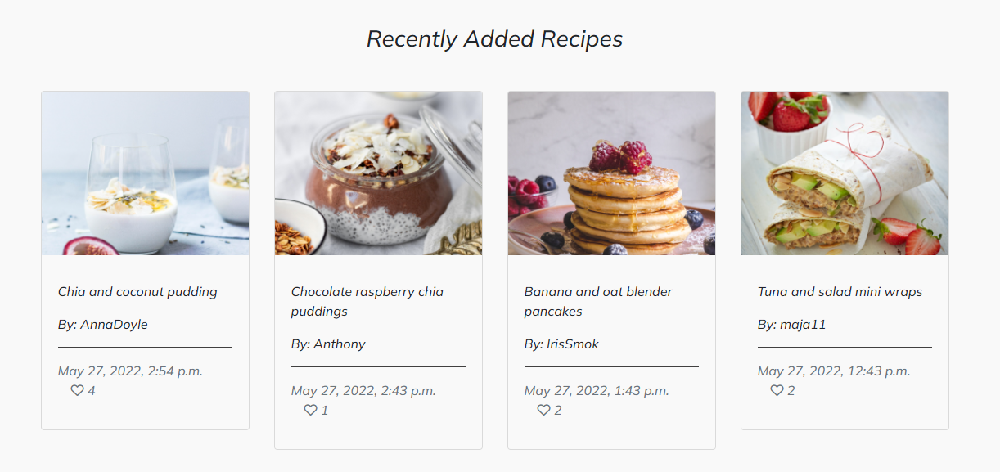
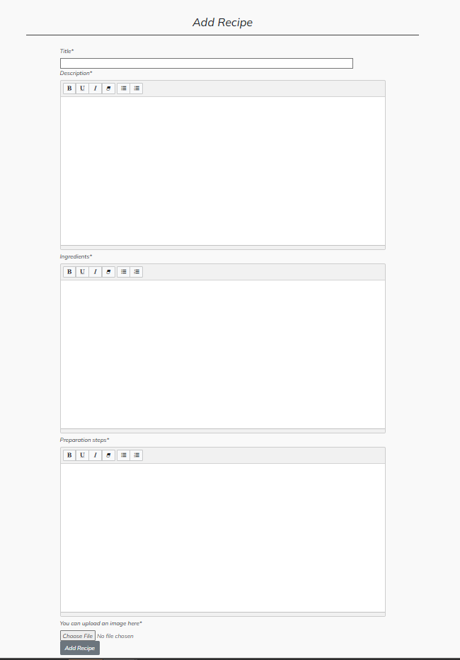

<h1 align="center">The Healthy Family</h1>

This is a full-stack framework project built using Django, Python, HTML, CSS and JavaScript. My goal is to create a functioning and responsive website, that allows users to post, comment and like or unlike recipes. This project has been built for educational purposes.

# About
The Healthy Family is a website where users can comment, like and view recipes and also share their own recipes with other users.
This page is intended for all parents and others who are looking for inspiration in preparing meals for their children. 

# Table of Contents 
1. [UX](#ux)
    - [User Stories](#user-stories)

2. [Scope](#scope)
    - [Features](#features)
    - [Future Features](#future-features)

3. [Structure](#structure)

4. [Wireframes](#wireframes)

5. [Database schema](#database-schema)

6. [Surface](#surface)

7. [Technologies Used](#technologies-used)

8. [Testing](#testing)

9. [Validating](#validating)

10. [Final Product](#final-product)

11. [Deployment](#deployment)

12. [Credits](#credits)

#
# UX
Using the core UX principles I first started with Strategy, thinking about the target audience & the features they would benefit from.

The target audience for 'The Healthy Family' are:

- all age groups but mostly females, mothers
- everyone who is looking for inspiration in preparing healthy meals for their children
- people who like to share their kitchen creations with others
- people who are not experts in cooking

These users will be looking for:
- An informative website, with information that is easy-to-find & concise
- A website that offers healthy and easy prepared meals
- Ability to make a user account in order to interact with the site content
- Ability to save liked recipes for later use
- Ability to post, comment and like recipes

This website will offer all of these things whilst also allowing for intuitive navigation and conformability of use.

## User Stories 

**Epic: Admin**
- As a site Admin I can create, edit and delete recipes and comments so that I can manage the site content
- As a site Admin I can access the admin panel so that I can manage recipes and comments
- As a site Admin I can log out of the admin panel so that I can disconnect from the website

**Epic: User Interaction**
- As a logged-in User I can write comments on recipes so that I can leave my feedback
- As a logged-in User I can like and unlike recipes so that I can mark which recipes I like
- As a User I can view the number of likes on recipes so that I can see which recipes are the most popular
- As a User I can view comments on recipes so that I can read other users opinions

**Epic: User Recipes**
- As a logged-in User I can post a recipes so that other users can see them
- As a User I can delete my recipes so that I can remove any unwanted recipes that I have made
- As a User I can edit recipes so that I can update any changes or mistakes to my recipes
- As a logged-in User I can upload an image along with my recipe so that other users can see what the dish looks like

**Epic: Login/Register**
- As a User I can register for an account so that I can interact with the site content
- As a User I can log in/out off my account if I wish so that I can connect or disconnect from the website
- As a User I can easily see if I'm logged-in or logged-out so that I can be sure what my status is

**Epic: Navigation**
- As a User I can easily navigate through the site so that I can view desired content
- As a User I can search the desirable recipe by keyword so that I can find the recipe I want faster
- As a User I can see the most loved recipes so that I can quickly find inspiration and see which recipes are most famous
- As a User I can see the most recent recipes so that I can keep up to date with the latest recipes

#
# Scope 

## **Features**

### **Home Page**
*Navigation bar:* 
- The navigation bar appears on every page so users can easily navigate through the site
- Navigation bar has links for 'Home', 'Recipes' and 'Login/Register' more links will be shown to logged in users
- If the user is logged in then the left side of the menu shows links for pages that only authorized users can visit and use, they are: 'Favorite Recipes', 'Your Recipes' and  'Logout'. Otherwise, the user will be given the option to 'Register' or 'Login'
- The user name will also appear on the bar, indicating which user is logged in
- A search bar is nested in the navbar to find recipes quickly
- The navbar is fully responsive, collapsing into a hamburger menu for medium and small screen size

*Hero Image:*
- The hero image welcomes the user with a short message advertising what the website is about
- The Login / Register button will take users to the login page, if users do not have an account there is a link to the registration page

*Recently added recipes:*
- Recently Added section shows the latest published recipes so users can quickly see recently published recipes
- The Recently Added section is fully responsive, showing 4 recipe cards
- Each recipe takes the user to the recipe details page
- Users can also see title, image, author, date posted, short description and number of likes

*Most Loved Recipes:*
- The Most Loved Recipes section displays the top 5 recipes with the most likes
- Each recipe takes the user to the recipe details page
- At the bottom of the list there is a link to the Recipes page that takes users to the page with all the recipes

*Footer:*
- Appears on every page snd contains social links
- Links are opened in a new tab to avoid dragging users from our site

### **Recipes Page**
- The Recipes page shows all the published recipes, recipes are shown in order from newest to oldest
- The site will paginate all recipe cards to display 6 to a page
- Each recipe card will display an image, authors name, date posted, short description and number of likes
- Each recipe card takes users to the recipe details page 

### **Login/Register**
- The Login / Register button takes users to the login page where they can also find a link to the Register page where they can create an account

### **Favorite Recipes Page**
- Only logged in users can see Favorite Recipes Page
- The Favorite Recipes page shows all the recipes that the user liked

### **Your Recipes Page**
- The Your Recipes page displays all the recipes that user has created
- At the top there is an Add Recipe button which takes user to the add recipe page
- Each recipe has two buttons, Edit and Delete
- Edit button takes user to the edit page
- Clicking the Delete button will display the message asking the users if they are sure they want to delete that particular recipe

### **Recipes Details Page**
- The Recipes Details Page displays all the information about the selected recipes
- At the top of the page, the recipe card will display Recipes name, author name, date posted and image
- The main body of the page contains short description of the recipe, ingredients and preparation steps
- Number of likes and comments are displayed after the preparation steps
- Commenting section is located at the end of the page, only logged in users can leave a comment

### **Add Recipe Page**
- On the Add Recipe page users can add their recipes to the website
- The user must fill in all the fields in order for the recipe to be published
- If the user doesn't fill in one of the fields the error message appears
- If the user doesn't provide their image, the default image is displayed
- The Add Recipe button is located at the end of the page

### Future Features
- Categories
- Users settings
- Preparation time
- Notification for likes and comments

#
# Structure
 
Since our target audience is mostly moms, but also everyone else who is looking for inspiration in preparing meals for children the structure idea
for The Healthy Family was to keep it simple. Simplicity helps users to quickly and easily access the app and navigate within the app.

The website is made from one app:
- recipes

# Wireframes
All wireframes were created used [Balsamiq](https://balsamiq.com/)

Wireframes for each device are linked here:
- [Desktop](assets/documents/Desktop-wireframes)
- [Tablet](assets/documents/Tablet-wireframes)
- [Mobile](assets/documents/Mobile-wireframes)

# Database schema

## Models
### **Post Model**

Please note that I am aware of this error. The Post model should be called the Recipe model. But when I wanted to change the name it was already too late because I had already written most of the code. The mentor mentioned to me that I should rename the model, but since the whole code was already written, I felt that changing the name was too much of a risk. I will avoid mistakes like this in the future

### **Comment Model**

# Surface

## Design 

## Chosen Color 
Color palette from [Coolors](https://coolors.co/9df57a-3c444c-fee73b-ff4f98-2daaf3-a9bedb)

- **#BBBBBB** - navbar background color. It fits nicely with the hero image.
- **#FFC107** - buttons color. I choose this color because it matches nicely with the rest of the page and it elevates the look of the page
- **#F9F9F9** - body site color. Fits nicely with the rest of the page. I choose this color because normal white color is to bright
- **#F1E3CF**- background color for login/register forms. I choose this color because it fits nicely with side image
- **#484747** - footer background color

## Font 
- Mulish, sans-serif - main font
- Patric Hand- for navbar logo and welcome message

# Technologies Used

## Languages 
- [HTML5](https://en.wikipedia.org/wiki/HTML5)
- [CSS3](https://en.wikipedia.org/wiki/CSS)
- [Python](https://www.python.org/)

## Frameworks, Libraries & Programs Used
[GitHub](https://github.com/) - Holds the repository of my project, GitHub connects to GitPod and Heroku.

[GitPod](https://gitpod.io/workspaces) – Connected to GitHub, GitPod hosted the coding space, allowing the project to be built and then committed to the GitHub repository. 

[Heroku](https://www.heroku.com/) - Connected to the GitHub repository, Heroku is a cloud application platform used to deploy this project so the backend language can be utilised/tested. 

[Django](https://www.djangoproject.com/) - This framework was used to build the foundations of this project

[Gunicorn](https://gunicorn.org/) - Gunicorn is a pure-Python HTTP server for WSGI applications.

[Dj Database URL](https://pypi.org/project/dj-database-url/) - This allows you to utilize the 12factor inspired DATABASE_URL environment variable to configure your Django application.

[Bootstrap](https://getbootstrap.com/) - Used to quickly add design to my website, Bootstrap focuses on mobile first design meaning this website is responsive across multiple devices ans screen sizes. 

[Cloudinary](https://cloudinary.com/?utm_source=google&utm_medium=cpc&utm_campaign=Rbrand&utm_content=492438439811&utm_term=cloudinary&gclid=Cj0KCQiAt8WOBhDbARIsANQLp96hTerzfFJ_P9lX0tEYEdtM3tSsYB6fhw-x3wQxOO0oc4hXm-A2ZBUaAptIEALw_wcB) - Used to store images online for the recipe posts. 

[Summernote](https://summernote.org/) Used to add a text area field to the admin setup to enable a list of ingredients and method steps.

[Google Fonts](https://fonts.google.com/https://fonts.google.com/) - provide fonts for the website.

[Font Awesome](https://fontawesome.com/) -was used for icons.

[Balsamiq](https://balsamiq.com/) - was used to create site wireframes.

[Am I Responsive](http://ami.responsivedesign.is/) - to check if the site is responsive on different screen sizes.

[Pixabay](https://pixabay.com/) and [Unsplash](https://unsplash.com/) - were used for all the images

[W3C Markup Validator](https://validator.w3.org/#validate_by_input) - was used to validate HTML

[W3C CSS Validator](https://jigsaw.w3.org/css-validator/) - was used to validate CSS

[Beautify](https://www.jpkc.com/tools/beautify/) - was used to correct indentation issues and get rid of too much whitespace - HTML, CSS

[Coolors](https://coolors.co/9df57a-3c444c-fee73b-ff4f98-2daaf3-a9bedb) - to make color palette

# Testing

## User Story Testing

### **Testing Users Stories form (UX) Section**

**EPIC: Superuser / Admin**
- As a site Admin I can create, edit and delete recipes and comments so that I can manage the site content
- As a site Admin I can access the admin panel so that I can manage recipes and comments
- As a site Admin I can log out of the admin panel so that I can disconnect from the website

This was tested by accessing the Django Admin Panel. By creating a Superuser we can access the Django Admin Panel where the administrator can perform all the CRUD functionalitis

**EPIC: User Interaction**
1. As a logged-in User I can write comments on recipes so that I can leave my feedback

2. As a logged-in User I can like and unlike recipes so that I can mark which recipes I like

3. As a User I can view the number of likes on recipes so that I can see which recipes are the most popular

4. As a User I can view comments on recipes so that I can read other users opinions

**EPIC: User Recipes**
1. As a logged-in User I can post a recipes so that other users can see them

2. As a User I can delete my recipes so that I can remove any unwanted recipes that I have made

3. As a User I can edit recipes so that I can update any changes or mistakes to my recipes

4. As a logged-in User I can upload an image along with my recipe so that other users can see what the dish looks like

**EPIC: Login/Register**
1. As a User I can register for an account so that I can interact with the site content

2. As a User I can log in/out off my account if I wish so that I can connect or disconnect from the website

3. As a User I can easily see if I'm logged-in or logged-out so that I can be sure what my status is

**EPIC: Navigation**
1. As a User I can easily navigate through the site so that I can view desired content

2. As a User I can search the desirable recipe by keyword so that I can find the recipe I want faster

3. As a User I can see the most loved recipes so that I can quickly find inspiration and see which recipes are most famous

4. As a User I can see the most recent recipes so that I can keep up to date with the latest recipes

## Bugs and Issues
- I had a problem where summernote field for preparation_steps wasn't loading. 
The error was corrected by deleting the unnecessary space after the quotation marks indicating the summernote field

- Error - my search engine could not search recipes by title. The mistake was in writing _icontain where there should be two __ I listed one _. 
I fixed the error bu adding another _ to __icontain

- Your_recipes page 404 - I had a problem when I tried to get your_recipes page it displays page 404. After checking that everything is correctly related to the names entered and I still haven't found the bug, I contacted tutor support. The problem was in Chrome, your_recipe page is loading in every other browser. The mistake was in my chrome extensions.

- Pagination was not working. Upon checking the django documents I realised I hadn't coded pagination correctly for Class views. Using the documentation I corrected the mistake.

- User image uploads weren't uploading to Cloudinary. To fix this I added  at the top of the file

# Deployment
This project was deployed using Github and Heroku.

## Github 
To create a new repository I took the following steps:

- Logged into Github.
- Clicked over to the ‘repositories’ section.
- Clicked the green ‘new’ button. This takes you to the create new repository page.
- Once there under ‘repository template’ I chose the code institute template from the dropdown menu.
- I input a repository name then clicked the green ‘create repository button’ at the bottom of the page.
- Once created I opened the new repository and clicked the green ‘Gitpod’ button to create a workspace in Gitpod for editing.

## Django and Heroku 
- To get the Django framework installed and set up I followed the Code institutes [Django Blog cheatsheet](https://codeinstitute.s3.amazonaws.com/fst/Django%20Blog%20Cheat%20Sheet%20v1.pdf)

# Credits

- All content was written by Iris Smok
- The structure of the gallery page is similar to the "Love Running" gallery page. I customized the design to fit my website.

- [Search bar](https://www.teckiy.com/blog/implementation-of-search-bar-using-django-in-any-website-2936659075/) - this site is used to help me build Search bar
- [Taste](https://www.taste.com.au/) - I copied recipes from this site for test posts

## Content

## Media

## Acknowledgements

